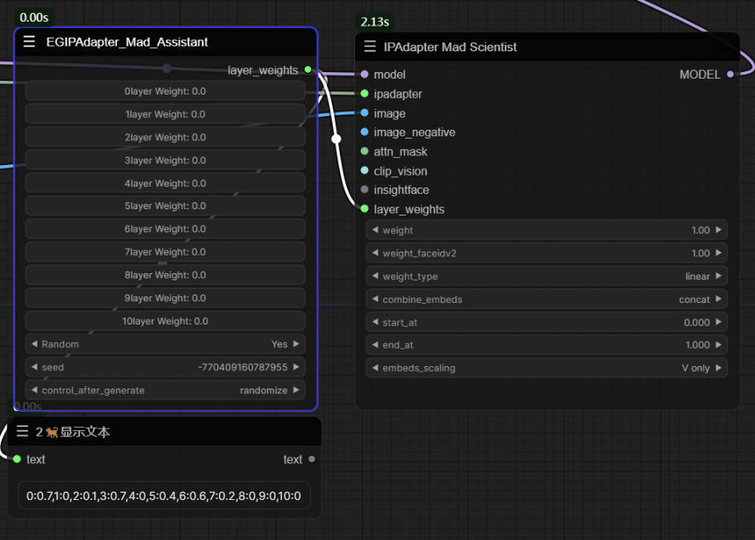
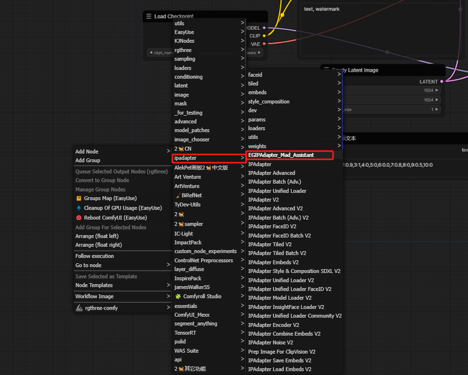
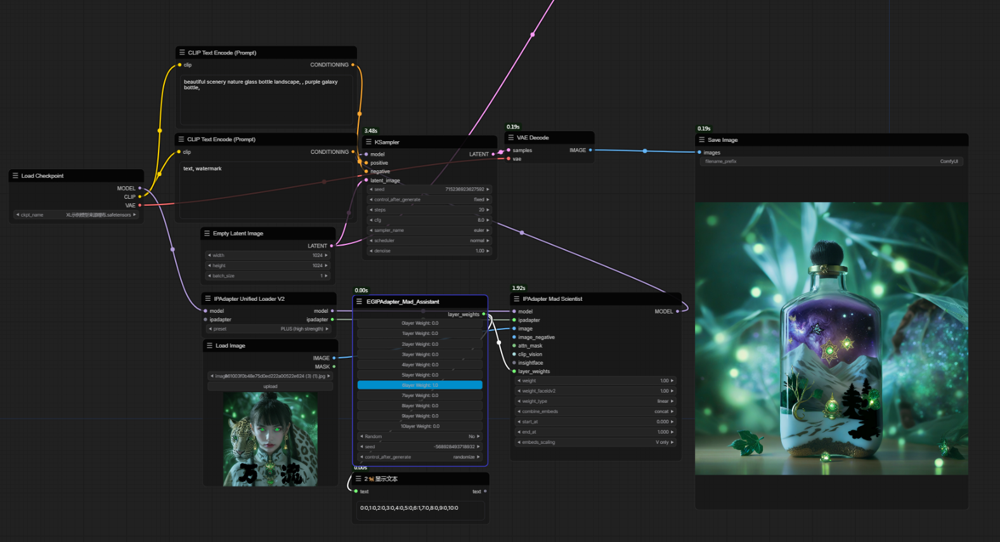
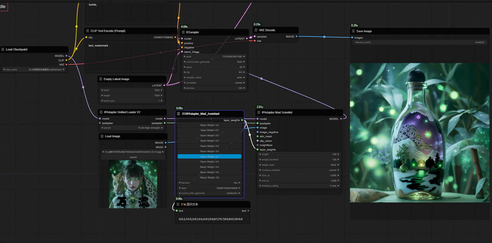
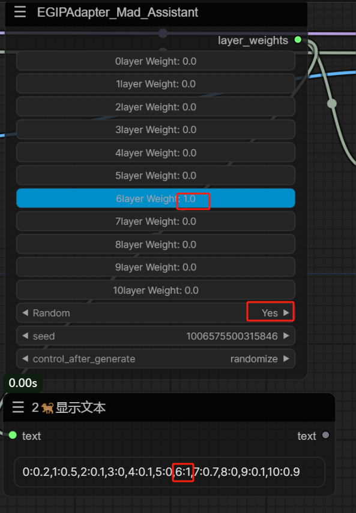

    
哈喽！我是二狗子（2🐕）！这是一个IPAdapter项目的分层辅助项目[IPAdapter项目地址](https://github.com/cubiq/ComfyUI_IPAdapter_plus)     
Hello! I am Er Gouzi (2) 🐕）！ This is a hierarchical auxiliary project for an IPAdapter project [IPAdapter project address]   

如果你没有代码基础，不会安装依赖或者安装节点时不想敲pip可以使用我制作的环境安装器    
[二狗环境编辑安装器][二狗环境便捷安装器](https://github.com/11dogzi/Comfyuinodes-HJGL)   

## 分层助手    
Layered Assistant        
滑块式快捷调整0-10层的注入权重，实现IPAdapter风格迁移的不同结果
Quickly adjust the injection weights of layers 0-10 in a slider style to achieve different results of IPAdapter style transfer   
    
节点分类（安装后可以在IPAdapter直接找到它，节点的名字为EGIPAdapter_Mad_Assistant）    
Node classification (after installation, it can be directly found in IPAdapter, and the node name is EGIPAdapter-Mad-Assistant)   
     

## 常规模式  
Normal mode    
将IPAdapter Mad Scientist节点中的layer_weights转为输入直接连接EGIPAdapter_Mad_Assistant，将Random设置为no则按照手动滑条权重进行对应层的输出    
Convert the layer_weights in the IPAdapter Mad Scientist node to input and directly connect to EGIPAdapter-Mad-Assistant. Set Random to no and output the corresponding layer according to manual slider weights      
    

## 随机模式   
Random mode    
将Random设置为Yes则按照手动滑条权重进行对应层的输出，且只对非0权重进行0-1的权重随机，例如：0-10层中6层权重为1，则0，1，2，3，4，5，7，8，9，10层权重为随机权重，6层始终保持手动设置的权重1    
If Random is set to Yes, the output of the corresponding layer will be based on the manual slider weight, and only the weight of non-zero weights will be randomly assigned to 0-1. For example, if the weight of 6 layers in the 0-10 layer is 1, then the weights of 0, 1, 2, 3, 4, 5, 7, 8, 9, and 10 layers will be randomly assigned, and the weight of 6 layers will always maintain the manually set weight of 1    
     
   

## 更多SD免费教程
More SD free tutorials   
灵仙儿和二狗子的Bilibili空间，欢迎访问：   
Bilibili space for Lingxian'er and Ergouzi, welcome to visit:   
[灵仙儿二狗子的Bilibili空间](https://space.bilibili.com/19723588?spm_id_from=333.1007.0.0)   
欢迎加入我们的QQ频道，点击这里进入：   
Welcome to our QQ channel, click here to enter:   
[二狗子的QQ频道](https://pd.qq.com/s/3d9ys5wpr)   
    
